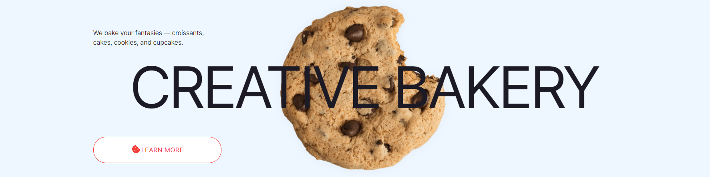

  

  
  
  
  

  <a href="https://ik-web.github.io/layout-page-creative-bakery/"><< DEMO LINK >></a> 

## Description:

A practical project - an adaptive landing page "Creative Bakery",  
for consolidating website layout skills using technologies such as  
HTML, CSS, SASS/SCSS, JavaScript.

## Developers

- [Ihor Kuchin](https://github.com/ik-web)

## License

                    GNU GENERAL PUBLIC LICENSE
                       Version 3, 29 June 2007

 Copyright (C) 2007 Free Software Foundation, Inc. <https://fsf.org/>
 Everyone is permitted to copy and distribute verbatim copies
 of this license document, but changing it is not allowed.
